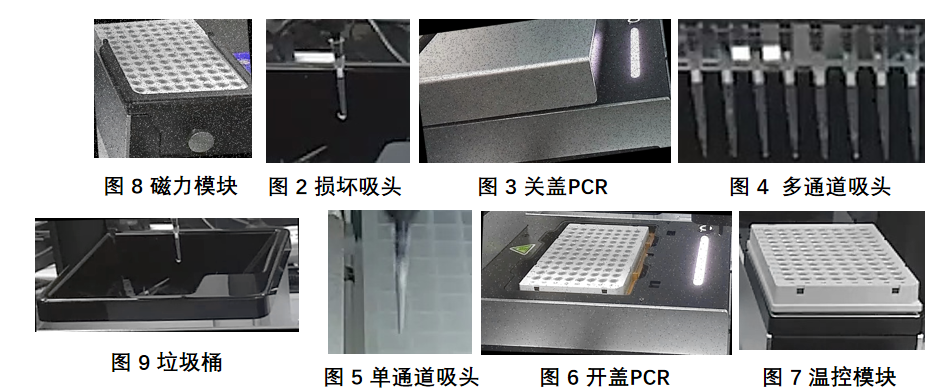
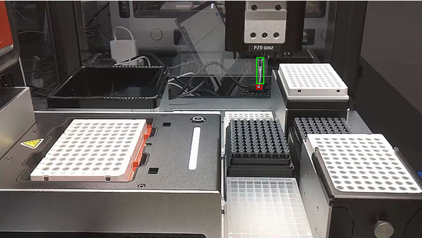
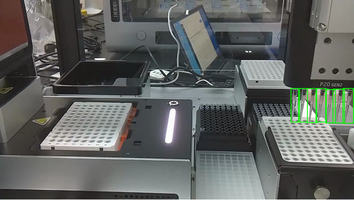
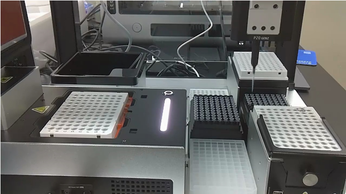

# SWIFT (Scalable lightWeight Infrastructure for Fine-Tuning)

<p align="center">
    <br>
    
    <br>
<p>
<p align="center">
<a href="https://modelscope.cn/home">ModelScope Community Website</a>
<br>
        <a href="README_CN.md">中文</a> &nbsp ｜ &nbsp English &nbsp
</p>

<p align="center">


<a href="https://github.com/modelscope/modelscope/"></a>
<a href="https://pypi.org/project/ms-swift/"></a>
<a href="https://github.com/modelscope/swift/blob/main/LICENSE"></a>
<a href="https://pepy.tech/project/ms-swift"></a>
<a href="https://github.com/modelscope/swift/pulls"></a>
</p>

<p align="center">
<a href="https://trendshift.io/repositories/6427" target="_blank"></a>
</p>


##  📖 目录
- [简介](#-简介)
- [安装](#-%EF%B8%8F-安装)
- [数据构造](#-数据构造)
- [模型微调](#-模型微调)
- [模型推理](#-模型推理)
- [模型评估](#-模型评估)
- [端侧部署](#-端侧部署)
- [文件路径](#-文件路径)
- [潜在风险](#-潜在风险)
## 📝 简介
本项旨在利用先进的多模态大模型 **GLM-4V-9B** 和 **Phi-3-vision** 实现对 OT-2 真实运行场景的实时帧理解异常检测。本项目整体流程涵盖了数据构造、模型微调、推理评估和端侧部署等关键环节。通过在基础模型上使用垂直领域的专用数据进行微调，以在垂域视觉语言任务中展现卓越的性能。鉴于由于OT-2实验场景中的真实数据十分稀缺采用了创新的方法来构造数据，以便让模型更好地学习相关知识和概念，并充分利用现有的数据资源。我们通过图像编辑和文本设计，创建了一个从局部到全局、从简单任务到复杂任务的逐步过渡性数据集，包括以下三个阶段的微调数据集：**局部概念对齐数据集**、**全局强引导学习数据集**和**全局弱引导学习数据集**。这三个阶段的数据集分别对应三个微调阶段，旨在逐步实现对场景物体的认知、对局部区域的理解、对全局关联的理解以及异常检测。将训练好的模型部署在NVIDIA Jetson AGX Orin平台上，实现端侧应用。

## 🛠️ 安装
- #### **安装GLM-4v-9b代码** ####
```shell
git clone https://github.com/THUDM/GLM-4.git

cd basic_demo
pip install -r requirements.txt

cd finetune_demo
pip install -r requirements.txt

# 自行安装deepspeed等包
pip install deepspeed
```
- 安装GLM-4v-9b模型

```shell
git lfs install
git clone https://www.modelscope.cn/ZhipuAI/glm-4v-9b.git
```
## 🌈 数据构造

- #### **GLM-4V数据集格式** ####
```plaintext
"messages": [
                {
                    "role": "user",
                    "content": "Question",
                    "image": "Path"
                },
                {
                    "role": "assistant",
                    "content": "Answer"
                }
            ]
```
- #### **局部概念对齐数据集** ####

     - 根据标签裁剪局部图片
     - GPT-4生成关于各类图片物体的多组QA并存入文本
     - 从文本中获取QA和图像地址构造CSV
     - 从CSV转为GLM-4V需求的数据格式





    
- #### **全局强引导学习数据集** ####
  
     - 根据标签在原图上绘制BBOX用于引导注意区域
     - GPT-4生成关于各类图片物体的多组QA并存入文本
     - 从文本中获取QA和图像地址构造CSV
     - 从CSV转为GLM-4V需求的数据格式





- #### **全局弱引导学习数据集** ####

     - 根据标签填充Prompt模板
     - GPT-4根据Prompt内容为每一张原图生成场景描述和异常判断
     - [预计]从文本中获取QA和图像地址构造CSV
     - [预计]从CSV转为GLM-4V需求的数据格式




## 🚀 模型微调
- GLM-4v-9b微调
```shell
bash /home/WCzhou/workspace/40_backup/VLM_paper/glm_sft.sh 
```

- 具体脚本
  
    CUDA_VISIBLE_DEVICES=0,2,3,4,5,6,7 OMP_NUM_THREADS=1  torchrun --standalone --nnodes=1 --nproc_per_node=7  /alldata/shared/VLM_project/GLM-4/finetune_dem o/finetune_vision.py  $JSON /alldata/shared/VLM_project/glm-4v-9b/  /alldata/shared/VLM_project/GLM-4/finetune_demo/configs/lora.yaml

- 参数：
   - CUDA_VISIBLE_DEVICE: 显卡选择
   - OMP_NUM_THREADS: 并行线程
   - nnodes: 节点设备
   - nproc_per_node: 显卡数
   - 微调脚本地址
   - 数据集地址
   - 模型地址
   - lora配置地址

## 🦄 模型推理
- **GLM-4v-9b直接推理**
```python
python /home/WCzhou/workspace/40_backup/VLM_paper/GLM-4/finetune_demo/inference.py  model_dir  data_dir  save_path
```
- 参数：
   - model_dir: 模型地址
   - data_dir: 数据集地址 [可以是包含多个jsonl的文件夹，也可以是单个jsonl文件]
   - save_path: 推理结果存为csv

***

- **GLM-4v-9b合并后推理**
```python
python /home/WCzhou/workspace/40_backup/VLM_paper/Merged_GLM/lora_merge.py 

python /home/WCzhou/workspace/40_backup/VLM_paper/GLM-4/finetune_demo/inference.py  model_dir  data_dir  save_path
```
- 注意： Lora合并后,移植glm-4v-9b中的 **tokenizer_config.json** ,并且注意配置文件的数量和官方更新
- lora_merge内部参数：
  
   - 修改原模型地址
  
   - 修改Lora地址

   - 修改输出模型地址     


## ✨ 模型评估
- 测试验证可视化
```python
run /home/WCzhou/workspace/VLM_Related_Code/metrics_visualizer.ipynb
```

- 子串与GPT-4联合检查Acc
```python
run /home/WCzhou/workspace/VLM_Related_Code/compute_acc.ipynb
```

## 🤖 端侧部署
- NVIDIA Jetson AGX Orin


## 📚 文件路径

以下是 `train_v4` 目录的文件结构：

```plaintext
train_v4/
├── 5Createdataset.py           # 阶段一数据构造
├── 6Createdataset.py           # 阶段二数据构造
├── Box_QA.csv                  # 阶段一CSV数据
├── Box_QA.py                   # 从QA文本来构造CSV
├── Box_QA_Shuffled.csv         # 阶段一构造的CSV
├── Box_QA_Shuffled_glm.jsonl   # 阶段一生成最终jsonl
├── Box_txt/
│   └── ...                     # 阶段一生成的QA文本
├── convert_data.py             # 将CSV转为需求格式
├── Createdataset.py
├── crop_image/
│   └── ...                     # 文件夹中包含各种裁剪后的图像，阶段一使用crop_box_6_new_box
├── dataset.yaml
├── GLM_SFT/                    # **现阶段GLM-4v所有微调数据的汇总**
│   └── ...                     
├── image_with_yolo_box/
│   └── ...                     # 文件夹中包含带有 YOLO 边框的阶段二图像数据
├── labels/
│   └── ...   
├── split.py                    # 数据集分割为训练、测试、验证
├── test.py
├── unlabeled_pool/
│   └── ...                     # 原始图像和标签
├── YOLO_QA_2.csv               # 阶段二第二版本CSV数据，实现控制输出为 A or B,便于验证和评估 [目前所使用]
├── YOLO_QA.csv                 # 阶段一第二版本CSV数据
├── Yolo_QA.py                  # 从QA文本来构造CSV
├── YOLO_QA_Shuffled_2.csv      # 打乱阶段二第二版本CSV数据，实现控制输出为 A or B,便于验证和评估 [目前所使用]
├── YOLO_QA_Shuffled.csv        # 打乱阶段一第二版本CSV数据
├── YOLO_QA_Shuffled_glm.jsonl  # swift尝试时期，阶段一GLM-4v数据集
├── YOLO_QA_Shuffled_phi3.json  # swift尝试时期，阶段一Phi3-v数据集
├── Yolo_txt/
│   └── ...                     # 阶段二生成的QA文本
```
以下是 `train_v4/GLM_SFT` 目录的文件结构：

```plaintext
train_v4
└── GLM_SFT
    └── Singel                  # 单论对话数据集
        ├── all_box2            # 阶段二数据集 
        │   └── ...             # 训练、验证、测试数据集以及相关代码
        ├── all_no_box          # 阶段三数据集 
        │   └── ...             # 训练、验证、测试数据集以及相关代码
        ├── region1             # 阶段一数据集 
        │   └── ...             # 训练、验证、测试数据集以及相关代码
        ├── S1_and_S2           # 训练阶段二增量数据，由阶段二数据+阶段一数据
        │   └── ...   
 ```       
以下是 `GLM-4` 目录的文件结构：

```plaintext
GLM-4/finetune_demo             
├── configs/
├── finetune.py
├── finetune_vision.py         # 视觉微调
├── inference.py               # 推理 [支持包含jsonl的文件夹和jsonl文件]
├── inference_single.py        # 固定QA的单张图测试
├── README_en.md              
├── README.md
└── requirements.txt
```

## 🔥 潜在风险
- 二阶段训练出现中断、超时结束、加速报错


